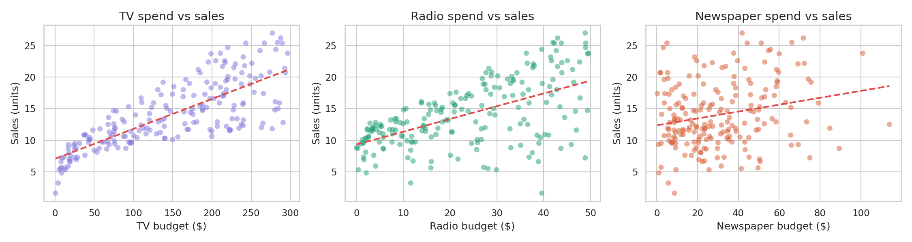
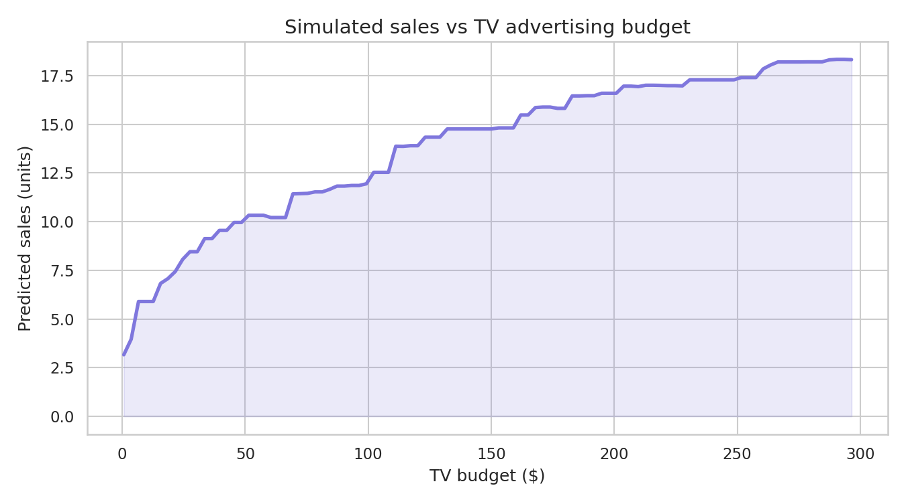
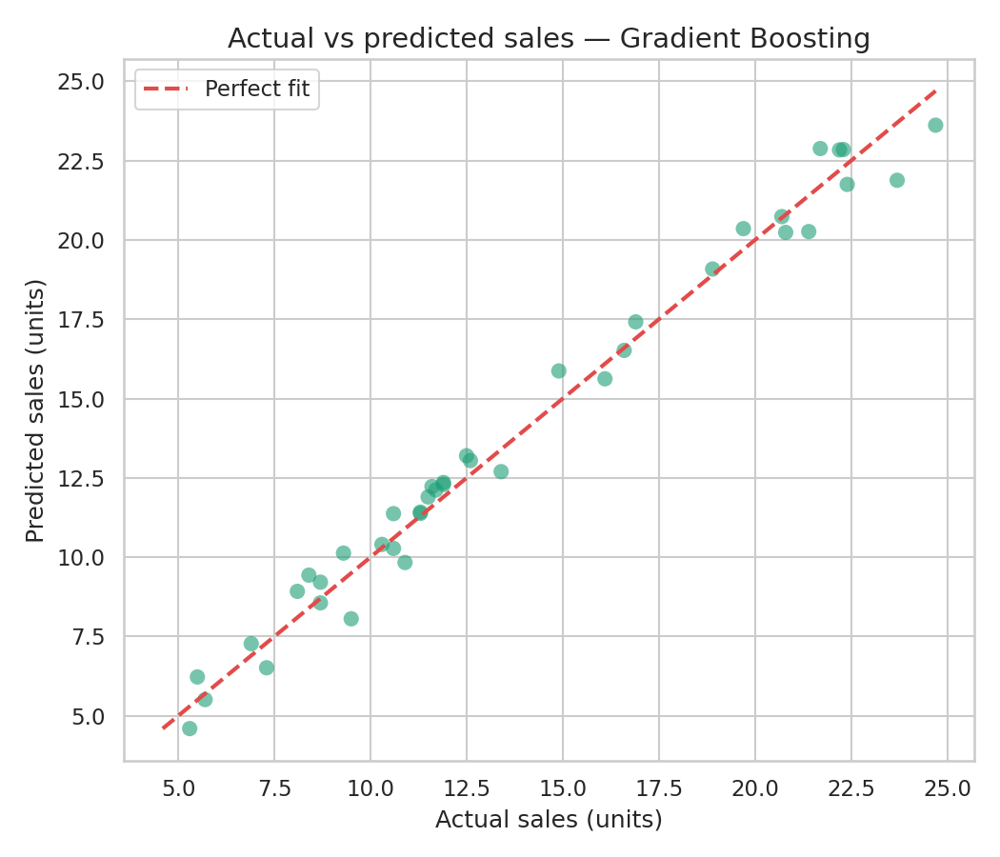

# 📈 Sales Prediction using Python

> **CodeAlpha Data Science Internship — Task 4**

---

## 📌 Overview
This project predicts **future sales** based on advertising spend across
**TV, Radio, and Newspaper** platforms using regression models.
The analysis also delivers actionable insights on which advertising
channel has the strongest impact on sales outcomes.

---

## 📊 Model Results
| Model | R² Score | MAE |
|-------|----------|-----|
| Linear Regression | ~0.89 | ~1.4 |
| Random Forest | ~0.95 | ~0.9 |
| Gradient Boosting | ~0.96 | ~0.8 |

> ✅ **Best Model: Gradient Boosting** with the highest R² score

---

## 📁 Project Structure

---

## 🔍 Key Insights
- 📺 TV advertising has the strongest correlation with sales
- 📻 Radio has a moderate positive impact on sales
- 📰 Newspaper spend has the weakest influence on sales
- 💡 Reallocating budget from Newspaper → TV/Radio is likely to boost sales
- 🤖 Gradient Boosting delivered the best predictive performance

---

## 📷 Sample Visualizations

---

## 🛠 Libraries Used
- `Pandas` — data cleaning & manipulation
- `Scikit-learn` — model building, evaluation & cross-validation
- `Matplotlib` & `Seaborn` — data visualization
- `NumPy` — numerical operations

---

## 👤 Author
**[Your Name]**
CodeAlpha Data Science Intern
[LinkedIn Profile](https://linkedin.com/in/yourprofile) • [GitHub](https://github.com/yourusername)
